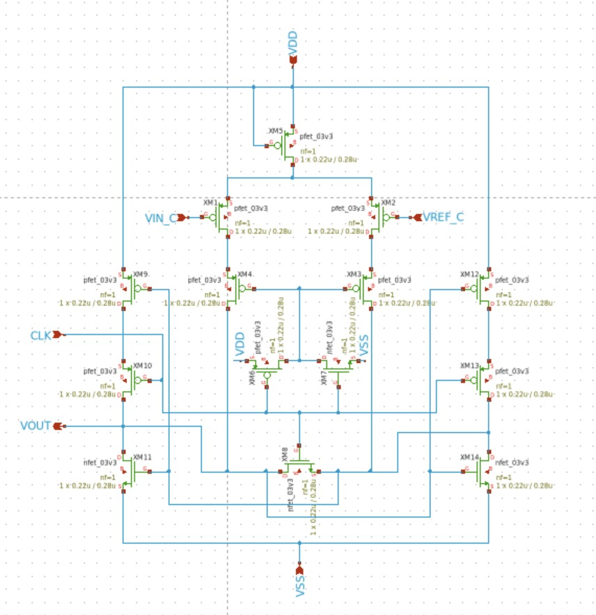
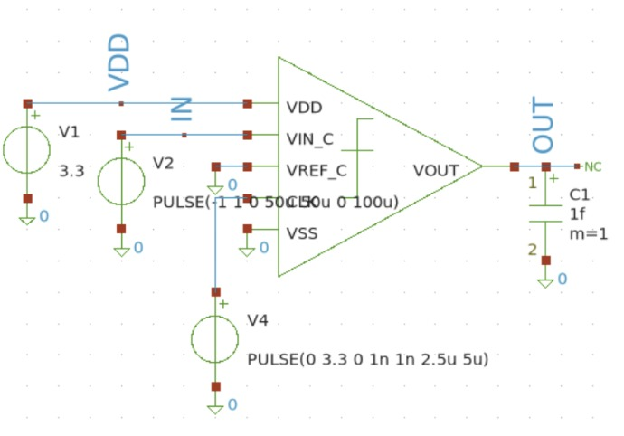
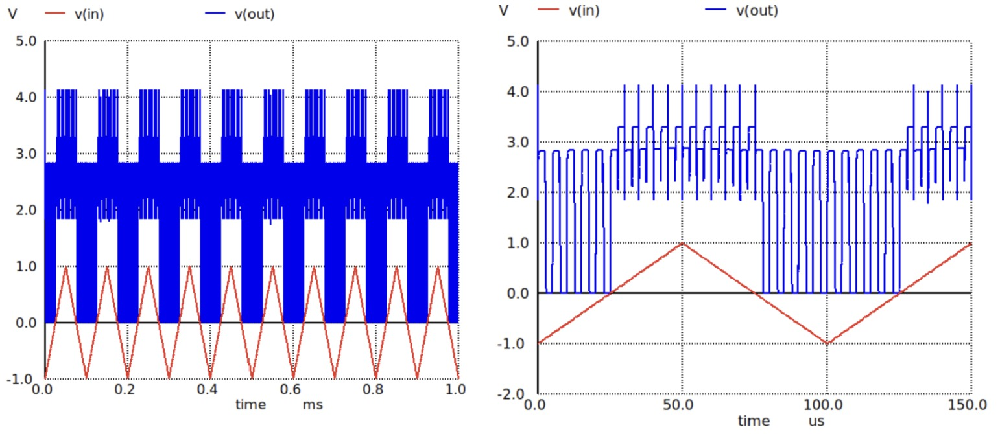

# Comparator Progress Log

The comparator is implemented as the 1-bit quantizer block in the first-order sigma-delta ADC. Its main function is to convert the analog output of the integrator into a digital bitstream. The comparator compares the differential integrator output and produces a logic output depending on which input is higher. This digital output is then sent to the 1-bit DAC feedback block and also represents the raw sigma-delta modulator bitstream.

In a sigma-delta ADC, the comparator does not directly produce the final multi-bit digital output. Instead, it generates a high-speed 1-bit stream whose pulse density represents the input signal. The final resolution is obtained after digital filtering and decimation. Therefore, the comparator must be fast enough to make a valid decision within the sampling clock period, while maintaining low input-referred offset, low metastability risk, and acceptable power consumption.

## Target Specification

| **Parameter** | **Value / Target** | **Unit** | **Notes** |
| :--- | :--- | :--- | :--- |
| **Electrical & DC Spec** | | | |
| Supply Voltage (VDD) | 3.3 | V | Standard system supply |
| Quantizer Resolution | 1 | bit | Single-bit output (High/Low) |
| Input Type | Differential | - | Connects to the difference amplifier output |
| Input Common-Mode | 1.65 | V | VDD/2, matching the analog front-end bias |
| Output Type | Digital CMOS | - | Rail-to-rail bitstream (0V to 3.3V) |
| **Dynamic & Transient Spec** | | | |
| Clock Frequency ($f_s$) | 12.288 | MHz | Oversampling clock ($T_s = 81.38 \, \text{ns}$) |
| Decision Time ($t_{pd}$) | < 50 | ns | Clock-to-Q propagation delay |
| Input Offset Voltage ($V_{os}$) | < 15 | mV | Dynamic offset from transistor mismatch |
| Kickback Noise | < 5 | mV | Transient noise fed back to the input nodes |
| Power Consumption | << 3 | mW | Mainly dynamic switching power ($C \cdot V^2 \cdot f$) |

## Schematic Design

  

<h4 align="center" style="font-size:16px;">Figure 1. Comparator Schematic</h4>

The comparator receives the differential output of the switched-capacitor integrator and converts it into a digital output. When the positive input is higher than the negative input, the comparator output switches to logic high. When the negative input is higher than the positive input, the comparator output switches to logic low.

In the sigma-delta loop, this comparator output controls the 1-bit DAC feedback path. Therefore, the comparator output must be valid before the DAC feedback value is sampled by the next clock phase. The comparator is designed to operate as a discrete-time block synchronized with the modulator clock.

## Design Considerations

| **Design Aspect** | **Consideration** |
|------------------|-------------------|
| Decision Speed | Must resolve before the next sampling phase |
| Input Offset | Should be minimized to reduce conversion error |
| Metastability | Must be reduced by sufficient regeneration gain and timing margin |
| Input Common-Mode Range | Must support the integrator output common-mode |
| Output Swing | Should be compatible with digital feedback/DAC control logic |
| Power Consumption | Should remain small compared to the OTA/integrator block |
| Kickback Noise | Should be considered because it can disturb the integrator output |
| Clocking | Must be synchronized with the sigma-delta sampling phases |

## Comparator Operation

| **Input Condition** | **Comparator Output** | **Meaning in Sigma-Delta Loop** |
|--------------------|------------------------|--------------------------------|
| Vp > Vm | Logic High | Select positive DAC feedback level |
| Vp < Vm | Logic Low | Select negative DAC feedback level |
| Vp ≈ Vm | Depends on offset/noise | Critical metastability region |

The comparator acts as the 1-bit ADC inside the sigma-delta modulator. Since the quantizer only has two output levels, linearity is less complex than in a multi-bit ADC. However, timing, offset, and metastability are still important because comparator errors directly affect the feedback loop behavior and modulator stability.

## Simulation Result

The comparator should be verified using DC, transient, and clocked decision simulations. The main purpose of the simulation is to confirm that the comparator can correctly resolve small differential input signals and produce a valid digital output within the available clock period.

### Testbench

### Transient Response

The comparator correctly resolves input polarity against the reference. In the zoomed view, the output goes high while the triangle is above 0 V (≈25–75 µs) and low while it is below 0 V, with transitions aligned to the reference crossings. The simulation result was correct and expected for HIGH/LOW response.

The output peaks at 4.15 V, about 0.85 V above VDD. No driven node can exceed its own supply; this indicates clock feedthrough onto a high-impedance output, made visible by the 1 fF load.

## Verification Status

| **Parameter** | **Target** | **Status** |
|--------------|------------|------------|
| Correct high/low decision | Required | To be verified |
| Output logic swing | 0 V to 3.3 V | To be verified |
| Decision time | Within clock phase | To be verified |
| Input-referred offset | Low offset | To be verified |
| Metastability behavior | Stable decision | To be verified |
| Power consumption | Within ADC budget | To be verified |
| PVT corner robustness | TT / FF / SS | To be verified |

## Performance of Designed Comparator

| **Parameter** | **Value / Target** | **Unit** |
|--------------|--------------------|----------|
| Supply Voltage | 3.3 | V |
| Comparator Resolution | 1 | bit |
| Input Common-Mode | 1.65 | V |
| Sampling Frequency | 12.288 | MHz |
| Output Logic Low | 0 | V |
| Output Logic High | 3.3 | V |
| Propagation Delay | To be simulated | s |
| Input-Referred Offset | To be simulated | V |
| Power Consumption | To be simulated | W |
| Corner Verification | Pending | - |

## Notes

The comparator is a critical block in the sigma-delta ADC because it determines the polarity of the integrator output and generates the 1-bit feedback control signal. Although the sigma-delta architecture can tolerate quantization noise through oversampling and noise shaping, comparator timing errors, excessive offset, and metastability can degrade the quality of the bitstream and reduce the achievable SNDR.

The comparator must therefore be verified together with the switched-capacitor integrator and 1-bit DAC feedback block to ensure correct loop operation.

**Last Updated: 18th July 2026**